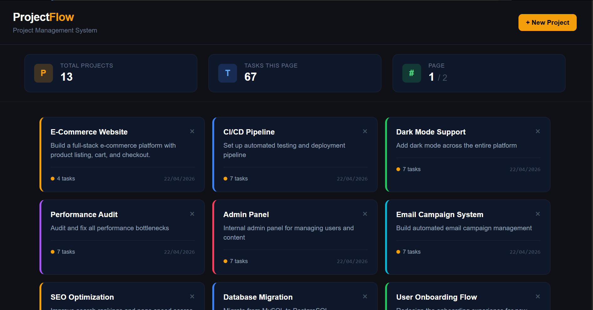
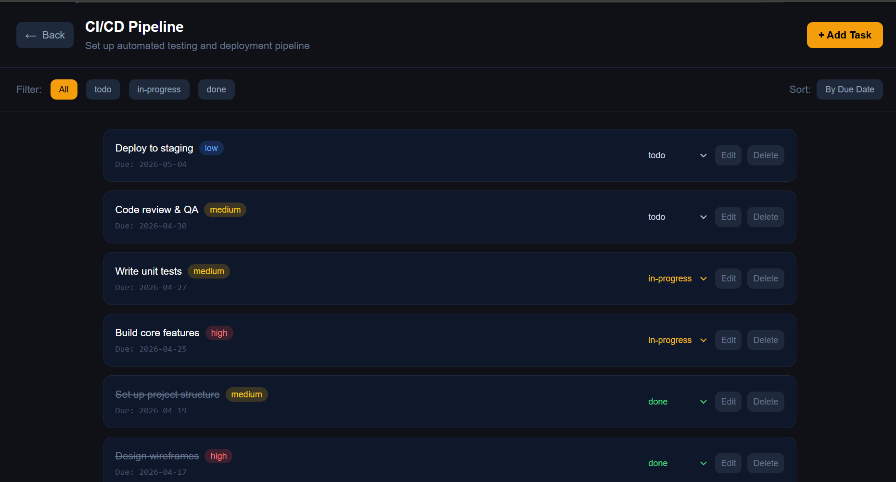

# ProjectFlow — Project Management System

A full-stack project management system built with Node.js, Express, PostgreSQL, and React.

## Tech Stack

**Backend:** Node.js, Express.js, PostgreSQL, pg (node-postgres)  
**Frontend:** React (Vite), Tailwind CSS, Axios, React Router DOM

---

## Features

- Create, view, and delete projects
- Create, edit, delete tasks under each project
- Filter tasks by status (todo / in-progress / done)
- Sort tasks by due date
- Pagination on both projects and tasks
- Input validation and error handling
- Responsive UI

---

## Screenshots

### Projects Page


### Task Detail Page


---

## Project Structure

mini-project-management/
├── backend/
│   ├── src/
│   │   ├── controllers/   # projectController.js, taskController.js
│   │   ├── routes/        # projects.js, tasks.js
│   │   ├── middleware/    # errorHandler.js
│   │   ├── db/            # pool.js
│   │   └── app.js
│   ├── seed.js
│   └── .env.example
├── frontend/
│   ├── src/
│   │   ├── api/           # projects.js, tasks.js
│   │   ├── pages/         # ProjectsPage.jsx, ProjectDetailPage.jsx
│   │   └── App.jsx
└── README.md


---

## Getting Started

### Prerequisites

- Node.js v18+
- PostgreSQL
- pgAdmin (optional, for DB management)

---

### 1. Database Setup

Open pgAdmin or psql and run:

```sql
CREATE DATABASE mini_pm;

\c mini_pm

CREATE TABLE projects (
  id SERIAL PRIMARY KEY,
  name VARCHAR(255) NOT NULL,
  description TEXT,
  created_at TIMESTAMP DEFAULT NOW()
);

CREATE TABLE tasks (
  id SERIAL PRIMARY KEY,
  project_id INTEGER NOT NULL REFERENCES projects(id) ON DELETE CASCADE,
  title VARCHAR(255) NOT NULL,
  description TEXT,
  status VARCHAR(20) DEFAULT 'todo' CHECK (status IN ('todo', 'in-progress', 'done')),
  priority VARCHAR(10) DEFAULT 'medium' CHECK (priority IN ('low', 'medium', 'high')),
  due_date DATE,
  created_at TIMESTAMP DEFAULT NOW()
);
```

---

### 2. Backend Setup

```bash
cd backend
npm install
```

Create a `.env` file in the `backend/` folder:

```env
PORT=5000
DB_HOST=localhost
DB_PORT=5432
DB_USER=postgres
DB_PASSWORD=yourpassword
DB_NAME=mini_pm
```

Start the backend:

```bash
npm run dev
```

Server runs at `http://localhost:5000`

Optional — seed sample data (12 projects + 7 tasks each):

```bash
node seed.js
```

---

### 3. Frontend Setup

```bash
cd frontend
npm install
npm run dev
```

Frontend runs at `http://localhost:5173`

---

## API Reference

### Projects

| Method | Endpoint | Description |
|--------|----------|-------------|
| POST | `/projects` | Create a project |
| GET | `/projects` | Get all projects (paginated) |
| GET | `/projects/:id` | Get project by ID |
| DELETE | `/projects/:id` | Delete a project |

**Pagination:** `GET /projects?page=1&limit=10`

#### Request body (POST /projects)
```json
{
  "name": "Website Redesign",
  "description": "Redesign the company website"
}
```

---

### Tasks

| Method | Endpoint | Description |
|--------|----------|-------------|
| POST | `/projects/:project_id/tasks` | Create a task |
| GET | `/projects/:project_id/tasks` | Get tasks for a project |
| PUT | `/tasks/:id` | Update a task |
| DELETE | `/tasks/:id` | Delete a task |

**Filter by status:** `GET /projects/1/tasks?status=todo`  
**Sort by due date:** `GET /projects/1/tasks?sortBy=due_date`  
**Combined:** `GET /projects/1/tasks?status=in-progress&sortBy=due_date&page=1&limit=10`

#### Request body (POST /projects/:id/tasks)
```json
{
  "title": "Design homepage",
  "description": "Create wireframes and mockups",
  "status": "todo",
  "priority": "high",
  "due_date": "2026-05-01"
}
```

#### Request body (PUT /tasks/:id) — all fields optional
```json
{
  "status": "in-progress",
  "priority": "medium"
}
```

---

## Sample API Responses

**GET /projects?page=1&limit=10**
```json
{
  "success": true,
  "data": [...],
  "pagination": {
    "total": 12,
    "page": 1,
    "limit": 10,
    "totalPages": 2
  }
}
```

**Error response**
```json
{
  "success": false,
  "message": "Project not found"
}
```

---

## Status & Priority Values

| Field | Allowed Values |
|-------|---------------|
| status | `todo`, `in-progress`, `done` |
| priority | `low`, `medium`, `high` |